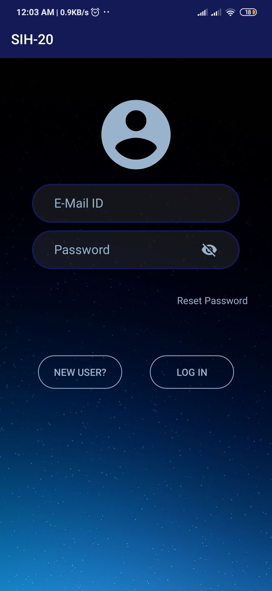
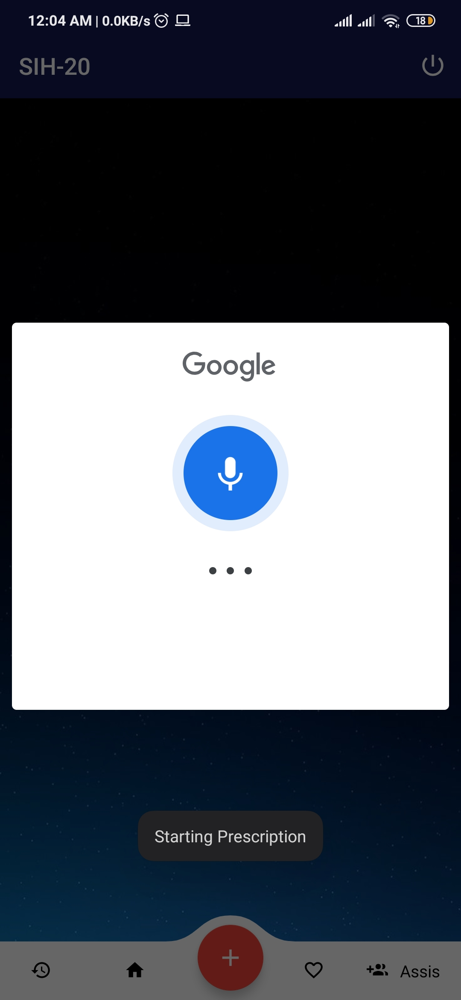
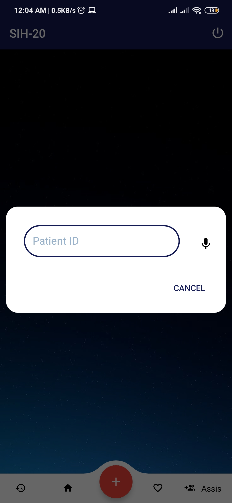
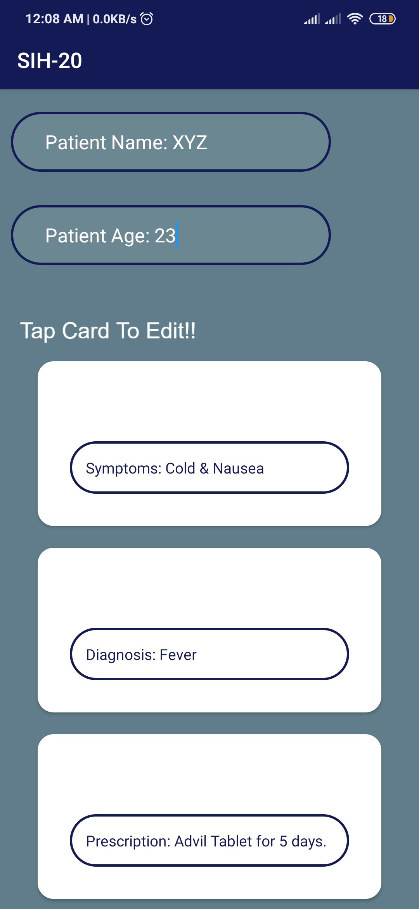

# VoicePrescription

Mobile platform to record dictated prescription by doctor, process and create a prescription, give smart recommendation
and share PDF of prescription to the patient. 

Doctors using different medical treatment approach such as Allopathic, homoeopathic, ayurvedic, etc will have different user
experience according to medical practices. The platform will suggest medicines and advice only in that category.

Features:

1. Lemmatization.
2. Speech-To-Text.
3. Custom Tokenizer.
4. Recommendation System for:
    i)   Prescribed Medicines.
    ii)  Symptoms.
    iii) Advices.
5. Correction for Prescribed Input through:
    i)  Text Input.
    ii) Voice Input.
6. Confirmation of Prescription via Doctor's Signature/Fingerprint.
7. HIPAA compliant database.

 Login Page 
                                           

 Voice Input Dialog Box 

 Edit Each Entity/Prescription Item before Confirmation 

 Final Prescription Generated 

